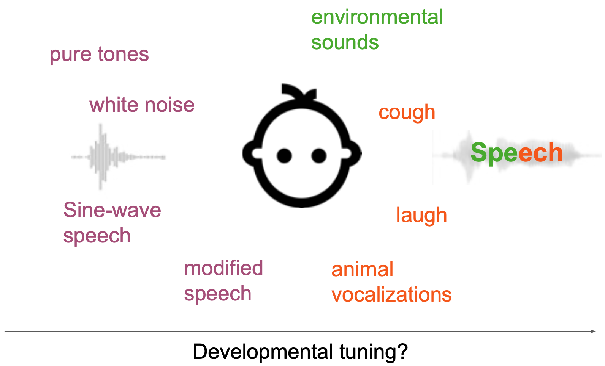
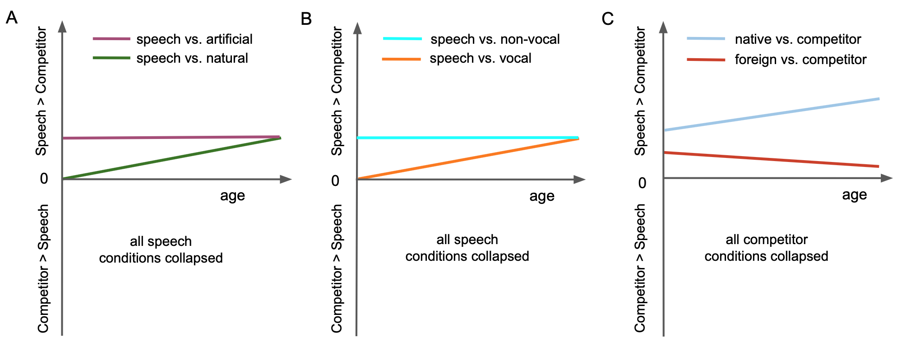
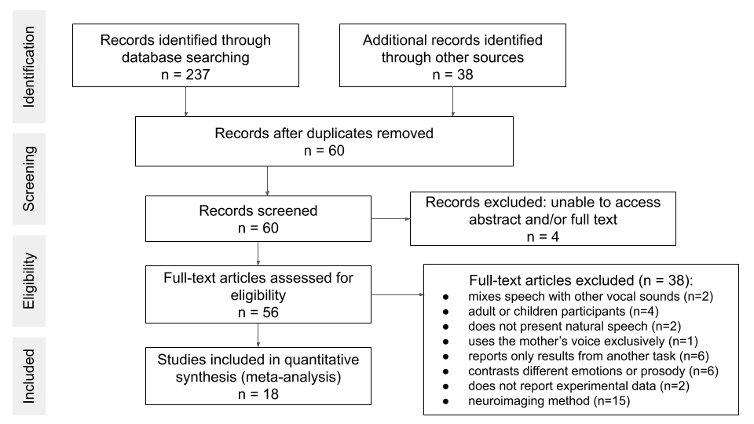
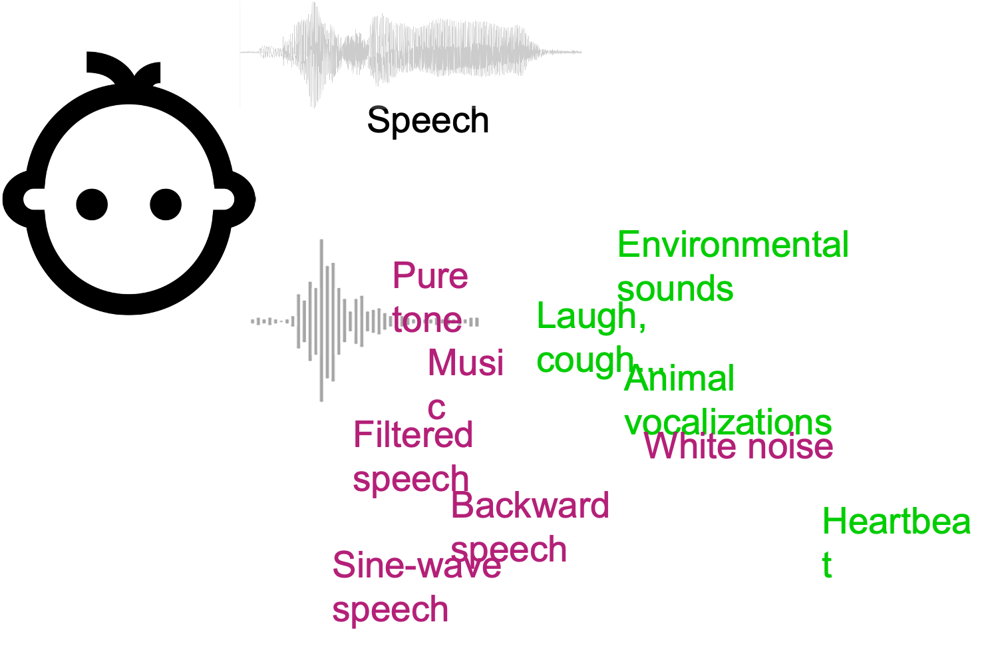
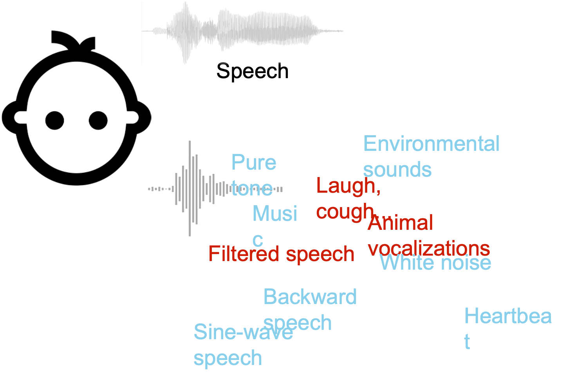
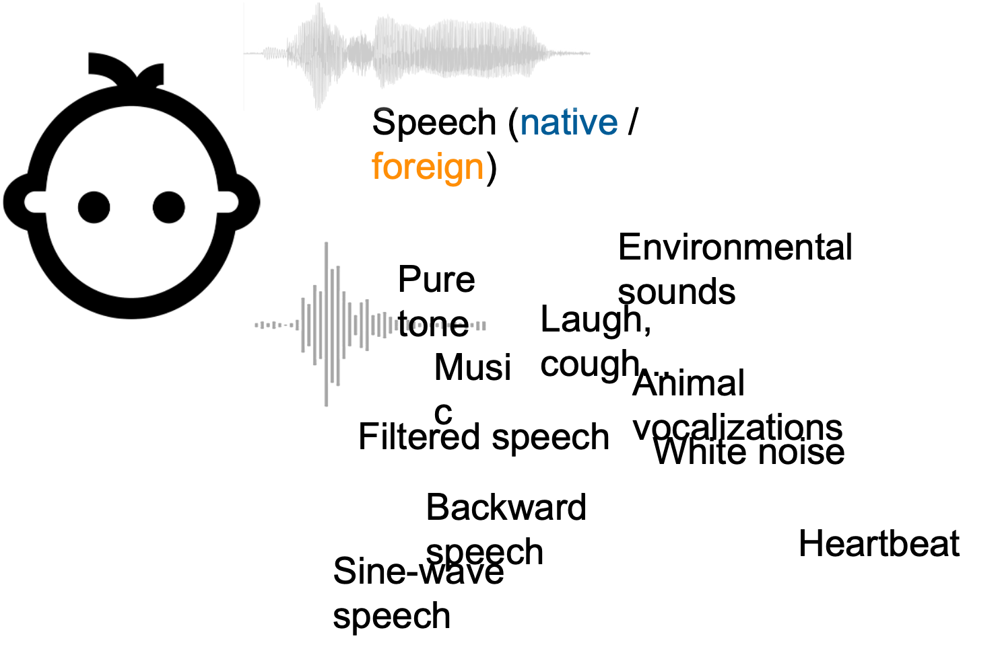

```{r setup, include=F}

knitr::opts_chunk$set(warning = FALSE, message = FALSE, cache = FALSE, echo = FALSE, include = F) #options for all the code chunks of the document.

source("data_completion.R", chdir = TRUE)  #chdir stands for "change directory"

library(metafor)
library(robumeta)
library(dplyr)
library(tidyr)
library(ggplot2)
library(stringr)
library(purrr)
library(grid)
library(gridExtra)
library(RCurl)
library(papaja)

sessionInfo()


read.csv('speech_pref_full_DB.csv')->DB

DB2 = DB[DB$method!='PL' & !is.na(DB$g_calc),] #keep only the behavioral experiments, remove NAs.

#Mark effect sizes more than 3 SD away from the mean effect (in both positive and negative directions) as outliers
DB2$outlier[DB2$g_calc > mean(DB2$g_calc, na.rm = TRUE) + 3*sd(DB2$g_calc, na.rm = TRUE) | DB2$g_calc < mean(DB2$g_calc, na.rm = TRUE) - 3*sd(DB2$g_calc, na.rm = TRUE)]<-T 

#unique experiments
papers <- levels(factor(DB2$short_cite))

#number of unique infants
DB2$n<-rowSums( cbind (DB2$n_1,DB2$n_2), na.rm=TRUE)
temp<-aggregate(n~same_infant,DB2,mean)

summary(DB2$mean_age_1)
```
# Significance

- Infants reliably prefer natural speech over other types of sounds
- Preference is stable from birth to the end of the first year of life
- Speech is preferred over both artificial and other natural sounds
- Speech is preferred over both non-vocal and other vocal sounds
- The language used for the speech sounds made no significant difference

# Introduction

**ci2all This first paragraph summarizes the main theory of speech preference, with the factors most commonly discussed (human/monkeys, speech/other vocalizations). I hope this will make it clear that we do know this view, and that our MA nuances it by including less cited/overlooked papers (not to mention that these mostly cited papers are all from the Vouloumanos lab. It might be good to take into account results from other labs).**

**ac2ci I made some edits particularly at the end of the para**

Humans acquire their communication skills from early infancy, with specialized speech perception abilities well before they produce their first word. These perceptual capacities manifest in an early preference for speech over other types of sound [@vouloumanos_listening_2007;@vouloumanos_tuning_2010;@ecklund-flores_asymmetric_1996]. Some studies show, at birth, a preference for speech over sine-wave speech [i.e., time-varying sinusoidals tracking the fundamental frequency and the first three formants; @vouloumanos_listening_2007]. Studies find no preference between speech and monkey calls at birth [@vouloumanos_tuning_2010;@shultz_three-month-olds_2010], but a preference for speech over monkey calls at three month old [@vouloumanos_tuning_2010]. Results like these have led to the theoretical proposal that speech is a privileged signal for humans, whereby newborns have a preference for the vocalizations of humans and non-human primates, and by three months tune in to human speech specifically [@vouloumanos_listen_2014]. These studies even found that three-month-olds favor human speech over other human vocal sounds, such as coughing [@shultz_three-month-olds_2010]. Because these results have been obtained both with the participants' native language [@vouloumanos_listening_2007;@vouloumanos_tuning_2010], and foreign language [@shultz_three-month-olds_2010], it was claimed that infants tune to the speech signal itself, and not simply the familiar sounds of their native language [@vouloumanos_listen_2014]. There have been variants of such views. For instance, @ecklund-flores_asymmetric_1996 documented behavioral responses that seemed specific to speech, and particularly information carried below 3500 Hz, which was different from other forms of filtered speech and natural sounds. The specificity of this behavioral response at a young age seems to suggest an early primacy of the speech bias.  

After decades of theoretical and empirical work in this area, the field has converged in a series of questions about the mechanisms that support speech perception in infants, not all of which have answers already: Does the auditory system process all sounds similarly, or are there dedicated mechanisms for speech? Does the preference for speech emerge from a low-level bias, whereby the auditory system better encodes sounds with acoustic properties that match particularly well with the acoustics of speech (processing similarly well other natural and vocal sounds)? Or does the preference stem from high-level linguistic processing (i.e., recognition of properties like syllabic structure)? In addition to asking these questions regarding preference at birth, drawing a developmental curve is crucial to tackle these questions: If speech is processed in a specific way as compared to other sounds, then from birth, infants should show a preference for speech as compared to other sounds. If speech benefits from properties that also apply to other sounds, then infants should first have a general preference for acoustically close sounds that match these properties (among them speech), and then gradually tune to speech as they are exposed to speech. Finally, if speech processing relies on the same auditory-general mechanisms as any other sound, then speech preference should emerge during the first year of life with language acquisition and depend on the language learned.  **ac2all I like the questions at the beginning of the paragraph, but not the hypotheses/predictions starting from the developmental curve part. We'll explain this a lot more clearly after we introduce the distinct hypotheses below. I'd prefer to add a question like "And how does this change with infant development (including exposure to one or more languages)?" and then I'd remove the para break and change the next sentence to start with "To seek the state-of-the-art answers to these questions, we synthesize..."**

Here, to test these hypotheses, we synthesize the available empirical data on infants’ preferences for speech over non-speech sounds from birth to the end of the first year of life using a meta-analytic approach. In order to do so, we clarify the conceptual separation between three factors that could in principle explain speech preference, but have not often been spelled out as alternative hypotheses in the past [but see XXX, p. YY, and ZZ, p. QQ, among other for pre-figurations of these ideas].
<!-- to test if the factors cited above explain the variability found in the literature.  -->
**ac2ci factors not yet introduced, so I changed the wording. Also, do you think it's strategically better to say that these ideas have not been spelled out & cite some people? or can we just cite people who conceptually separated them? Also, could we cite people who have talked about each of the biases below, even if in a way that was more confused across factors?**

```{r venn, include=T, fig.cap="Developmental tuning for speech in the first year of life: infant would first discriminate artificial (purple) and natural (green) sounds, then vocal sounds (orange) within natural sounds, and ultimately speech as a separate category within natural and vocal sounds."}

```

**ac2ci in each of the following paragraphs there was an assumption of increases with exposure that is not necessary for each of the hypotheses. I removed it throughout! I also changed the order as Sho had suggested**

A first possibility, which we will call a **naturalness bias**, to explain infants' preference for speech is that the auditory system is tailored for the acoustic properties of speech, as well as sounds with close acoustical properties (e.g., other natural or vocal sounds). This idea has been pervasive in the field of auditory neuroscience, relying on the hypothesis that the auditory system has been shaped by evolutionary pressure to efficiently encode ecologically important sounds, typically environmental sounds signalling a threat, or conspecific vocalizations, and more generally natural sounds such as wind, rain, or the sound of a river, as well as those produced by biological systems, such as heart beats, step sounds, or animal vocalizations, and speech. Following this hypothesis, numerous studies have shown that natural sounds are processed more efficiently by the auditory system, from the cochlea [@smith_efficient_2006] to the auditory cortex [see @mizrahi_single_2014 for a review]. If a naturalness bias (partially) explains infants' speech preference, then we should observe a stronger preference at birth for speech over artificial competitors than when contrasting speech against another natural sounds. 
<!-- Infants would then gradually tune to speech as they acquire language during the first year of life.  -->
**ac2ci the last sentence doesn't follow, right? this hypothesis doesn't speak of dev't. I removed it. I also changed the preceding sentence to the prediction I think we should make**

A second possibility, the **vocal bias**, is that auditory coding is tailored to vocal sounds more specifically, rather than to all natural sounds. Vocal sounds have acoustic signatures, since they are characterized by modulations introduced by the vocal tract, with harmonically related energy peaks. Animal vocalizations (among them speech) are characterized by low temporal and spectral modulations, therefore form a separate acoustic category within natural sounds [@singh_modulation_2003].  This view is supported by studies that found that newborns showed no preference for speech compared to monkey calls, which are both vocal sounds [@vouloumanos_tuning_2010]. If a vocal bias explains at least partially speech preferences, then we should observe a stronger preference for speech over non-vocal competitors than when contrasting speech against other vocal sounds. 
<!-- This initial preference for vocal sounds would then tune to speech specifically during the first year of life as infants acquire language. -->
<!-- As a result, it is possible that infants initially have a broad category of vocal sounds, including the vocalizations of other species that also use oral communication (e.g. other primates and birds), and later tune to speech as they acquire their native language and build specialized linguistic abilities. -->
**ac2ci a sentence in the middle & end doesn't follow, because this hypothesis doesn't speak of dev't. I removed them. I also changed the Vouloumanos cite to fit the explanation**


A third distinct conceptual hypothesis is that there are dedicated perceptual mechanisms that are specific to speech, and distinct from how other vocal or natural sounds are processed -- **a speech bias**. Previous studies provided evidence for this hypothesis: newborns respond more to natural speech than to heartbeat, high-pass or band-ass filtered speech [@ecklund-flores_asymmetric_1996]. Newborn and one-month-old infants even prefer natural to low-pass filtered speech, which mimics what's heard in the womb [@ecklund-flores_asymmetric_1996;@cooper_developmental_1994]. If a speech bias explains speech preference at least partially, we should see preferences for speech over other sounds, including natural and vocal sounds. 
<!-- This preference should strengthen with language acquisition, and become stronger during the first year of life when infants are tested with their native language. -->

A final possibility would be that the fetus' brain initially encodes all sounds equally well, and the preference emerges due to exposure to speech -- an **exposure bias**. Previous results about language preference make this explanation plausible: Newborns prefer their native speech as compared to prosodically distinct foreign speech [e.g., @mehler_precursor_1988; @moon_two-day-olds_1993]. If one could test unborn children before exposure to much speech, speech would not be preferred to any other sound. Since that is impossible, given that newborns have been exposed to speech for three months by fullterm birth, one predicts from this hypothesis that preferences would get stronger during the first year of life, and that speech preference would be greater for the infant's native language than foreign languages. 
<!-- If this mechanism is at play in speech preference, infants should show no preference at all at birth, and after a few months a stronger preference for speech over other sounds when tested with their native language, and a weaker or no preference when tested with a foreign language.   -->
**ac2ci I made lots of changes in this paragraph, in part to clarify the explanation and avoid repetition of predictions**


## A meta-analytic approach

In sum, previous results on infants' preference for speech are broadly compatible with a preference for natural over artificial, vocal over non-vocal, and/or familiar over unfamiliar sounds, potentially interacting with infants' age. It should be noted that all four biases could be at play, and indeed several of them are sometimes integrated in one and the same theoretical framework [CITE CITE CITE CITE CITE CITE CITE]. However, from a conceptual standpoint, they reflect different hypotheses and assumptions about infants' perceptual system, and thus it is worthwhile to entertain them as separate accounts. 

In fact, with the right data, their predictions can be teased apart, and with enough power, the field would be able to attribute relative weights to each of the biases. A first step in this direction is to synthesize previous literature, to assess the extent to which these conceptually distinct factors have been independently manipulated in experimental designs. We can then measure the extent to which the literature supports their joint predictions (i.e., a preference for speech), and their individual predictions, as far as possible given the extent of currently confounded factors in past literature. This also allows us to identify empirical gaps (e.g., age groups that are under-represented but are crucial to tease apart two factors) and conceptual gaps (e.g., use of stimuli that systematically confounds two or more of those explanations). 

In this paper, we seek to directly test these potential mechanisms by employing a meta-analytic approach, which is recommended over narrative reviews [@cristia2021theory].  A meta-analysis can integrate data from experiments that vary in their methodology, as well as test the effect of factors of theoretical importance, by redescribing the stimuli used as a function of those factors. For instance, a study measuring preference for native speech over white noise provides data on a natural versus artificial contrast, as well as a vocal versus non-vocal contrast, thus accounting for how the same stimuli can be both natural and vocal or artificial and non-vocal. 

Also, we can draw a developmental timeline across the age range covered by the literature, beyond age groups tested within papers. This is particularly useful in developmental psychology, which relies on age-related differences that need to be tested statistically [@gelman_difference_2006]. Meta-analyses offer a powerful statistical approach to directly test for interactions with age across the whole age-range covered by the literature. To give an example from a previous developmental meta-analysis, it had been proposed that infants’ preference for novel or familiar items related to infants' age such that, all things equal, younger infants showed familiarity preferences whereas older infants exhibited novelty preferences [@hunter_multifactor_1988]. However, stable familiarity preferences across the first two years have been found for word segmentation in natural speech [@bergmann_development_2016]; and a stable novelty effect ensues for artificial grammars implemented in synthesized speech, whereas those implemented in natural speech led to stable familiarity preferences [@black_quantifying_2017]. Meta-analyses are therefore important to statistically and systematically test the theoretical predictions proposed in qualitative reviews, and show subtle effects that are difficult to see when reading the literature with a human eye.

Single experiments tell us about what a specific group of participants, presented with a specific set of stimuli, at a specific point in time has done. Meta-analyses are the following step because they provide a principled statistical approach to integrate those individual and specific results into a larger picture. By aggregating the numerous individual studies of a literature, meta-analyses gain statistical power. As a result, meta-analyses can reveal small effects that are difficult to show in individual experiments. By integrating data across different laboratories, they provide evidence for the generalizability of effects, and facilitate comparisons between experimental results. 

Finally, meta-analyses offer tools to detect publication bias in the literature. By aggregating all the available evidence for a phenomenon, we can see if the distribution of effect sizes has an unexpected shape, typically with an excess of positive results due to the difficulty to publish null or negative results. We can further integrate this information, and derive a new estimate of the overall effect size.

## The present study

Meta-analyses provide a unique vantage point on a body of work as a whole. We therefore first check for how strong infants' preference for speech over other types of sounds is according to the public body of literature. We additionally assess this body of data for evidence of publication bias. 

We then turn to our key interest, namely shedding light on the potential mechanisms underlying infants' speech preferences. Meta-regressions assess whether the proposed mechanisms of naturalness, vocal quality, and familiarity drive this preference, and how the preference develops over the first year of life. Assuming all three mechanisms are at play, and further assuming that the definition of the preferred stimulus narrows with age, we predicted that infants will show (see Figure \@ref(fig:hyp)): 

1. a greater preference for speech over other natural sounds as a function of age, but a preference for speech over artificial sounds that is stable over development; 
2. a greater preference for speech over other vocal sounds as a function of age, but a stable preference for speech over non-vocal sounds over development;
3. a greater preference for native speech over non-speech as a function of age, but a smaller preference for foreign speech over non-speech with age.

```{r hyp, include=T, fig.cap = "Hypothesized pattern of preference: the x axis shows age, the y axis represents the effect size derived from the contrast between a speech condition and a competitor condition (preference for speech over the competitor is plotted up; the lower quadrants are empty because we do not predict a preference for the competitor over speech). A: Speech contrasted to natural (green) or artificial (purple) competitors. B: Speech contrasted to vocal (orange) or non-vocal (cyan) competitors. C: Collapsing across competitors, separating speech in a foreign language (red); speech in the native language (blue)."}

```

# Methods

This meta-analysis was carried out following PRISMA recommendations [@moher_preferred_2009]. In addition, we provide information on all steps (including PRISMA checklist, data, and code) for full transparency and accountability via online supplementary materials; https://osf.io/4stz9/?view_only=d0696591ebf34bfc8430f848cd945ca8. 

## Literature search

We composed the initial list of papers with suggestions by experts (authors of this work); one google scholar search (*("speech preference" OR "own-species vocalization") AND infant - "infant-directed"*), the same search in PubMed and PsycInfo (last searched on 2019-09-24); and a google alert. We also inspected the reference lists of all included papers. Finally, we emailed a major mailing list to ask for missing data. We received two replies, one of which revealed a formerly undiscovered published study, and communicated unpublished data [@santolin_infants_2020].

## Inclusion criteria

After a first screening based on titles and abstracts using more liberal inclusion criteria, we decided on final inclusion based on full paper reading. We included experiments that tested human infants from birth to one year of age, and contrasted speech sounds with any other type of sound, measuring behavioral preferences to the sounds (e.g., looking times). If a paper reported results from neurotypical and at-risk infants, we included only the data from the neurotypical group.

Given our key interest in the preference for speech over other sounds, we excluded studies that contrasted two different speech sounds (e.g., foreign vs. native language, or adult vs. child-directed speech, or mother vs. stranger's voice); or two different non-speech sounds (e.g., backward speech vs. animal vocalizations). In addition, we excluded experiments where the contrast presented to the infants could not be coded according to our three mechanistic explanations. This meant the exclusion of experiments where speech was presented in the mother’s voice (which thus confounds between speech and individual voice recognition for our familiarity factor). Finally, we excluded neuroimaging experiments to avoid mixing results from different brain regions with different response profiles. We included published (i.e., journal articles) as well as unpublished works (i.e., doctoral dissertations) as long as sufficient information was provided. 

A PRISMA flow chart summarizes the literature review and selection process (Figure \@ref(fig:prisma)). The full list of the papers that were inspected together with final inclusion decisions are available in a decision spreadsheet (see the online supplementary materials; https://osf.io/4stz9/?view_only=d0696591ebf34bfc8430f848cd945ca8).

```{r prisma, include=T, fig.cap = "PRISMA flowchart summarizing the literature review and selection process."}

```

## Coding

Data were coded by the first author. In addition, 20% of the papers were randomly selected to be coded by the last author independently, with disagreements resolved by discussion. There were 10 disagreements out of a total of 260 fields filled in, and they were indicative of the coders not following the codebook, which led to a revision of all data in four variables. 

The critical variables for our purpose are key stimuli characteristics, infant age, and testing method (central fixation, high amplitude sucking, head-turn preference procedure). As for key stimuli characteristics, we coded familiarity, naturalness, and vocal quality, as follows.

For **naturalness**, the competitor sound was coded as natural if it was produced by a biological organism without any further acoustic manipulation. Natural competitors included animal calls, environmental sounds (e.g. wind or water sounds), heartbeat, bird song, non-speech vocalizations (e.g. laughter or coughs). If the authors applied acoustic manipulations, the competitor was coded as artificial. Artificial competitors included sine-wave speech, filtered speech[^1], white noise, instrumental music, and speech with altered rhythmic structure. The only exception was for newborn experiments presenting low-pass filtered speech mimicking the filtering applied by the womb. Given the recency of the intra-uterine environment to newborns (about 2 days), we coded these as natural. 

[^1]: In the case of filtered speech, the modulations introduced by the vocal tract are still present at the retained frequencies, and formant transitions are consistent with vocal production constraints. For this reason, filtered speech can be considered as vocal but not natural. Because the womb acts as a low-pass filter, newborn infants are familiar with low-pass filtered speech, but this familiarity fades after birth.

For **vocal quality**, the competitor sound was considered as vocal if it was produced by an animal vocal tract (human or not), either original or modified. Vocal competitors included non-speech vocalizations, animal calls, bird songs, and filtered speech. Non-vocal competitors included backward speech (that has abrupt closures that cannot be produced by the vocal tract), white-noise, environmental sounds, instrumental music, heartbeat, and sine-wave speech (that lacks the harmonic structure introduced by the natural resonance of the vocal tract). 

For **familiarity**, we considered the language in which the speech sounds were recorded (native or foreign).


We coded all the statistical information reported in the included papers. If reported, we coded the mean score and the standard deviation for speech, and the other sound separately. When infant-level data was provided, we recomputed the respective mean scores and standard deviations based on the reported individual scores. If reported, we also coded the t-statistic between the two sound conditions, or an F-statistic provided this was a two-way comparison. If effect sizes were directly reported as a Cohen’s d or a Hedges' g, we also coded this. 

## Effect sizes

Once the data were coded, we extracted effect sizes, along with their respective variance. Effect sizes were standardized differences (Cohen’s d) between response to speech vs. the competitor.
If effect sizes were not directly reported in the papers, we computed them using the respective means and SDs [@lipsey_practical_2001], or a t- or F-statistic [@dunlap_meta-analysis_1996]. As our effect sizes came from within-subject comparisons (e.g., looking time of the same infant during speech and monkey calls), we needed to take into account the correlation between the two measurements in effect sizes and effect size variances computations. We computed this correlation based on the t-statistic, the respective means, and SDs [@lipsey_practical_2001] if they were all reported; or imputed this correlation randomly if not. We finally calculated the variance of each effect size [@lipsey_practical_2001]. Cohen's d were transformed to Hedges' g by multiplying d by a correction for small sample sizes based on the degree of freedom [@borenstein_introduction_2011].

We did not center age because our hypotheses included a developmental progression from birth to the end of the first year of life. We were therefore interested in the intercept at age 0 (i.e., birth).

Analyses use the R [@r_core_team_r:_2018] package Robumeta [@hedges_robust_2010], which allows us to fit meta-analytic regressions that take into account the correlated structure of the data when repeated measures are obtained from the same infant groups within papers. 

# Results

## Database description

We found a total of `r length(papers)` publications (labeled with an asterisk in the reference list) reporting `r length(unique(DB2$same_infant))` experiments, for a total of `r sum(temp$n)` infants, and `r length(DB2$g_calc)` (not mutually independent) effect sizes, see Figure \@ref(fig:forest). `r length(unique(DB2$study_ID[DB2$peer_reviewed == 'yes']))` papers have been submitted to or published in peer-reviewed journals [@cooper_developmental_1994; @vouloumanos_tuned_2004; @vouloumanos_tuning_2010; @shultz_three-month-olds_2010; @colombo_method_1981; @vouloumanos_five-month-old_2009; @sorcinelli_preference_2019; @yamashiro_does_2019; @segal_listening_2011; @curtin_speech_2013; @vouloumanos_foundational_2014; @vouloumanos_listening_2007; @vouloumanos_tuning_2010; @spence_prenatal_1987; @ecklund-flores_asymmetric_1996; @santolin_role_2019; @vanden_bosch_der_nederlanden_infant_2020; @segal_infants_2021]. The remaining 1 publication contributing `r length(DB2$g_calc[DB2$peer_reviewed == 'no'])` effect size was a thesis  [@ference_role_2018]. `r length(DB$g_calc[DB2$study_ID=="santolinUnpub"])` more effect sizes were contributed by authors of unpublished work [@santolin_infants_2020].

Experiments tended to have small sample sizes, with a median N of `r median(DB2$n)` children (Range = [`r max(DB2$n)`, `r min(DB2$n)`], M = `r mean(DB2$n)`), which is close to the field standard [@bergmann_promoting_2018], but much lower than current recommendations [@oakes_sample_2017]. Infants ranged from `r round(min(DB2$mean_age_1)/30.44)` to `r round(max(DB2$mean_age_1)/30.44)` months (`r min(DB2$mean_age_1)` to `r max(DB2$mean_age_1)` days), although the majority were under 6 months of age (`r length(unique(DB2$same_infant[DB2$age_months<=6]))/length(unique(DB2$same_infant))*100`% of the experiments). Individual samples comprised `r round(mean(DB2$gender_1, na.rm=TRUE)*100)`% of female participants on average. Infants were native of 6 different languages across the whole database (English, French, Russian, Yiddish, Hebrew, Italian). 
Experiments were performed in 10 different laboratories from 4 different countries (United States, Canada, Israel, Italy). `r length(unique(DB2$method))` experimental methods were used: `r length(unique(DB2$same_infant[DB2$method=='CF']))` experiments used Central Fixation (CF) (also called sequential looking preference procedure) [@cooper_developmental_1994; @vouloumanos_tuned_2004; @vouloumanos_tuning_2010; @shultz_three-month-olds_2010; @colombo_method_1981; @vouloumanos_five-month-old_2009; @sorcinelli_preference_2019; @yamashiro_does_2019; @segal_listening_2011; @curtin_speech_2013; @vouloumanos_foundational_2014; @ference_role_2018; @santolin_role_2019; @vanden_bosch_der_nederlanden_infant_2020; @santolin_infants_2020; @segal_infants_2021]; `r length(unique(DB2$same_infant[DB2$method=='HAS']))` used High-Amplitude Sucking (HAS) [@vouloumanos_listening_2007; @vouloumanos_tuning_2010; @spence_prenatal_1987]; and `r length(unique(DB2$same_infant[DB2$method=='HPP']))` used Head-turn Preference Procedure (HPP) [@ecklund-flores_asymmetric_1996]. Trial length was fixed in `r length(unique(DB2$same_infant[DB2$trial_length=='fixed']))` experiments, and infant-controlled in `r length(unique(DB2$same_infant[DB2$trial_length=='infant_controlled']))` experiments. 

Speech sounds were spoken by a female in `r length(unique(DB2$same_infant[DB2$talker_gender=='female']))` out of `r length(unique(DB2$same_infant))` experiments, with an infant-directed prosody in `r length(unique(DB2$same_infant[DB2$prosody=='IDS']))` out of the `r length(unique(DB2$same_infant))` experiments. Speech was presented in isolated segments (i.e. words or syllables) in `r length(unique(DB2$same_infant[DB2$utterance_length=='words']))` experiments, and full sentences or passages in `r length(unique(DB2$same_infant[DB2$utterance_length=='passages']))` experiments. Speech stimuli were recorded in the infant native language in `r length(unique(DB2$same_infant[DB2$test_lang=='native']))/length(unique(DB2$same_infant))*100`% of the experiments. Strikingly, experiments using the infants' native language tested infants from 0 to 12 months of age, whereas experiments using a foreign language only tested infants from 3 to 9 months of age (see Figure \@ref(fig:lang)). 
The competitor sound was vocal in `r length(unique(DB2$same_infant[DB2$vocal=='yes']))/length(unique(DB2$same_infant))*100`% of the experiments. The competitor sound was natural `r length(unique(DB2$same_infant[DB2$natural=='yes']))/length(unique(DB2$same_infant))*100`% of the experiments.
The stimuli characteristics are summarized on Figures \@ref(fig:stimuli) and \@ref(fig:competitors).

```{r stimuli, include=T, fig.cap = "Histograms of the number of effect sizes for each language and moderator status."}
hist_voc <- ggplot(data = DB2)+
  geom_bar(stat = 'count', aes(x = vocal, fill = test_lang), position = 'dodge')+
  scale_fill_manual(values = c("red3","skyblue"), labels = c("foreign","native"), name = "speech sound")+
  theme_classic()+
  labs(x = "Vocal quality", y = "Number of effect sizes")+
  theme(text = element_text(size = 10))

hist_nat <- ggplot(data = DB2)+
  geom_bar(stat = 'count', aes(x = natural, fill = test_lang), position = 'dodge')+
  scale_fill_manual(values = c("red3","skyblue"), labels = c("foreign","native"), name = "speech sound")+
  theme_classic()+
  labs(x = "Naturalness", y = "Number of effect sizes")+
  theme(text = element_text(size = 10))

grid.arrange(hist_voc, hist_nat, ncol=1, nrow=2)
```


```{r competitors, include=T, fig.cap = "Histogram of the number of effect sizes for each competitor."}
ggplot(data = DB2)+
  geom_bar(stat = 'count', aes(x = contrast_stim))+
   scale_y_continuous(limits = c(0, 10), breaks = seq(0,10,1))+
  theme_classic()+
  labs(x="Competitor sound", y = "Number of effect sizes")+
  theme(text = element_text(size = 15), legend.position = c(.9, .9),axis.text.x=element_text(angle=45, hjust=1))
```

## Average effect size

```{r forest, include=T, fig.cap = "Forest plot of effect sizes available in the literature, along with their respective moderator status. The average effect size is plotted on the bottom line. ",fig.width=7,fig.height=9}
#average variance / infant group to build models with CORR, and allow robumeta to detect correlated effect sizes within papers. 
DB2 = DB2 %>% group_by(same_infant) %>% mutate(g_var_m = mean(g_var_calc))

#AC added outlier removal bc I was getting errors
DB2 = DB2[!DB2$outlier,]

# Model without moderators to get the average effect size
base_model <- robu(g_calc ~ 1, data=DB2[!DB2$outlier,], modelweights = "CORR", studynum = same_infant, var.eff.size = g_var_m, small = T) 

# same model with metafor for a nice forest plot 
simple_model <- rma(g_calc, g_var_calc, data=DB2, weighted = TRUE, method = "REML", subset=!DB2$outlier & !is.na(DB2$g_calc), slab =DB2$study_ID) 

forest.rma(simple_model, annotate = FALSE, xlim = c(-13,3), ylim = c(-1,54), order = 'obs',
       xlab = 'Effect size (Hedges\' g)', mlab = "", alim = c(-1.5,3), steps = 6, cex.axis = 0.6, cex.lab = 0.7, 
       ilab=cbind(round(DB2[!DB2$outlier,]$age_months, digits = 1), as.character(DB2[!DB2$outlier,]$method), as.character(DB2[!DB2$outlier,]$natural), as.character(DB2[!DB2$outlier,]$vocal), as.character(DB2[!DB2$outlier,]$test_lang)),
       ilab.xpos=c(-7.4,-6.2,-5,-3.8, -2.5)) 
op <- par(cex=.5)
text(c(-7.4,-6.2,-5,-3.8, -2.5), 53, c("age", "method", "natural", "vocal", "language"))
```


```{r attempt at creating the table with all the info, eval=F}

table(DB2$natural,DB2$vocal,DB2$test_lang)

```

We integrated all effect sizes in a meta-analytic regression without any moderator, and found an average effect size g of `r base_model$reg_table$b.r` (SE = `r base_model$reg_table$SE`, CI = [`r base_model$reg_table$CI.L` , `r base_model$reg_table$CI.U`]) (Table 1, and Figure \@ref(fig:forest), diamond), corresponding to a medium effect size.
Heterogeneity among effect sizes was estimated at $\tau^2$ = `r simple_model$tau2` (I^2^ = `r simple_model$I2`%), which was significant (Q = `r simple_model$QE`, p < 0.01) despite the removal of outliers before running the model. This strongly suggest differences across experiments, and invites analyses using moderators.

```{r Table1, results="asis", include=T}
table1 = rbind(base_model$reg_table[,c(2:4,7:8)])
rownames(table1)=c('average effect size')

table1[,4]=paste0(round(table1[,4],2)," - ",round(table1[,5],2))
table1=table1[,-5]

apa_table(table1, digits=2, align='lcccc', col.names=c("","estimate","SE","t","confidence interval"), caption = "Statistical results of meta-regression without any moderator.", escape= T)

```

## Publication bias

```{r bias, include = T, fig.cap="Funnel plot of effect sizes and their respective standard errors. Black dots: effect sizes observed in the literature. White dots: missing effect sizes, suggestive of a publication bias$^2$. Vertical line: average effect size after filling the missing effect sizes."}

#add symmetrize
tf <- trimfill(simple_model) 
funnel(tf, cex=1.5, xlab='Effect size (Hedges\' g)', ylab="Standard Error of Effect Size g", digits=2, legend=TRUE)

# testing for asymetry (indicates a publication bias)
SEg = regtest(DB2$g_calc,DB2$g_var_calc)
k = ranktest(DB2$g_calc,DB2$g_var_calc)

#Identify the missing ES filled
missing_ES = setdiff(tf$yi[1:63],DB2$g_calc[DB2$outlier==F])

#find where their doppleganger are in DB2

# duplicate the line in DB2

# change the duplicated g_calc for the filled one.
```

We checked for the presence of a potential publication bias in the body of literature by studying the relationship between standard errors of effect sizes as a function of Hedges’ g (see funnel plot in Figure \@ref(fig:bias))[^2]. A regression test on these data was significant (z = `r SEg$zval`, p < 0.01), as  was the Kendall's tau rank correlation test for funnel plot asymmetry (Kendall's tau = `r k$tau`, p < 0.01), consistent with a publication bias in the literature.


[^2]: If the literature is not biased, effect sizes should be evenly distributed around the mean effect size, with increasing standard error as they go away from the mean effect size (both in the positive and negative directions, white triangle in the funnel plot). This is reflected by a symmetrical funnel plot, with no linear relationship between effect sizes and standard errors. 

To check whether this bias fully explains infants' speech preference, we  symmetrized the funnel plot with the “trim and fill” method [@duval_trim_2000]. To symmetrize the funnel plot, `r tf$k0` (SE = `r tf$se.k0`) missing experiments were needed on the left side of the plot. The corrected effect size was estimated at `r tf$beta[1,1]` (SE = `r tf$se`) after filling in the `r tf$k0` missing experiments, which is still significantly different from zero. Thus, even correcting for a potential publication bias, we still find statistical evidence for infants' preferring speech over competitors.

## Moderator analyses

We then tested if heterogeneity could be accounted for by the mechanistic explanations described in our introduction. Following our hypotheses, we fit a meta-analytic model with the following moderators: 

- mean age of children;
- naturalness of the competitor sound (coded as yes if it was natural and no otherwise);
- vocal quality of the competitor sound (coded as yes if it was vocal and no otherwise);
- familiarity with the language used (native or foreign).

These moderators were specified without interactions to avoid overfitting.

```{r moderators}
#distribution of moderators
table(DB2$natural)#no. of natural and non-natural data points
table(DB2$vocal)#no. of vocal and non-vocal data points
table(DB2$homospecific)#no. of homo- and heterospecific data points
table(DB2$test_lang)
table(DB2$homospecific,DB2$vocal)
table(DB2$natural,DB2$vocal)
table(DB2$contrast_stim)

#setting up of predictors 
#http://stats.idre.ucla.edu/r/library/r-library-contrast-coding-systems-for-categorical-variables/

#check that the experimental method doesn't make a difference
DB2$method = factor(DB2$method)
relevel(DB2$method,"HAS")->DB2$method #put HAS as the 1st level
#dummy coding: each level is compared to a reference level of the dependent variable, intercept corresponds to the reference level.
contrasts(DB2$method) = contr.treatment(length(levels(DB2$method)),base=1) #baseline method should be HAS because it's the one used with newborns

#moderators of interest
DB2$test_lang = factor(DB2$test_lang)
contrasts(DB2$test_lang) <- contr.treatment(length(levels(DB2$test_lang)),base=1)

DB2$natural = factor(DB2$natural)
contrasts(DB2$natural) <- contr.treatment(length(levels(DB2$natural)),base=2)

DB2$vocal = factor(DB2$vocal)
DB2$vocal <- factor(DB2$vocal)
contrasts(DB2$vocal) <- contr.treatment(length(levels(DB2$vocal)),base=2)
table(DB2$natural,DB2$vocal,DB2$test_lang)
summary(table(DB2$natural,DB2$vocal,DB2$test_lang))#super significant, these are correlated!


# model with moderators of interest. 

full_model <- robu(g_calc ~ natural + vocal + test_lang + mean_age_1, data=DB2[!DB2$outlier,], modelweights = "CORR", studynum = same_infant, var.eff.size = g_var_m, small = T)

```

None of the moderators was significant (see Table \@ref(tab:Table2)). 

```{r Table2, results="asis", include=T} 

table2 = rbind(full_model$reg_table[1:5,c(2:4,7:8)])
rownames(table2)=c('intercept','naturalness','vocal quality','language','age')

table2[,4]=paste0(round(table2[,4],2)," - ",round(table2[,5],2))
table2=table2[,-5]

apa_table(table2, digits=2, align='lcccc', col.names=c("","estimate","SE","t","confidence interval"), caption = "Statistical results of meta-regression with all moderators. The intercept corresponds to the effect size when the competitor is natural, and vocal, and speech is in a foreign language, at age 0. The moderator estimates correspond to changes in the intercept when the target stimuli are in the native language (familiarity); the competitor is artificial (naturalness); and the competitor is non-vocal (vocal quality).", escape= T)
```


```{r natural, include=T, fig.cap="Effect sizes as a function of age and natural quality of the competitor. The size of each dot is inversely proportional to the variance. Positive effect sizes reflect a preference for the speech sound, negative effect sizes reflect a preference for the competitor sound."}
ggplot(data=DB2[!is.na(DB2$natural),], aes(x=age_months, y=g_calc, colour=natural))+
  geom_point(aes(size=1/DB2[!is.na(DB2$natural),]$g_var_calc), show.legend = F, na.rm = TRUE)+
  stat_smooth(data=subset(DB2, outlier = F), method = "glm", na.rm = TRUE, alpha=0.3)+
  scale_x_continuous(name = "Mean age (months)", breaks = seq(0,12,1))+
  scale_y_continuous(name = "Effect size (Hedges' g)", limits = c(-1, 3), breaks = seq(-1,3,1))+
  geom_hline(yintercept=0, linetype="dashed", color="grey")+
  scale_colour_manual(values = c("mediumvioletred","green3"), labels=c("artificial","natural"), name = "other sound")+
  theme_classic()+
  theme(text = element_text(size = 15), legend.position = c(.9, .9))

#stim = 

#grid.arrange(stim, scatter, ncol=2, nrow=1)
```

```{r TableNatural, results="asis", include=T} 

model_natural <- robu(g_calc ~ natural*mean_age_1, data=DB2[!DB2$outlier,], modelweights = "CORR", studynum = same_infant, var.eff.size = g_var_m, small = T)

table_nat = rbind(model_natural$reg_table[c(1:2,4),c(2:4,7:8)])
rownames(table_nat)=c('intercept','naturalness','naturalness*age')

table_nat[,4]=paste0(round(table_nat[,4],2)," - ",round(table_nat[,5],2))
table_nat=table_nat[,-5]

apa_table(table_nat, digits=2, align='lcccc', col.names=c("","estimate","SE","t","confidence interval"), caption = "Statistical results of meta-regression with naturalness and its interaction with age as moderators. The intercept corresponds to the effect size when the competitor is natural, at age 0. The moderator estimates correspond to changes in the intercept when the competitor is artificial (naturalness).", escape= T)
```

```{r vocal, include=T, fig.cap="Effect sizes as a function of age and vocal quality of the competitor. The size of each dot is inversely proportional to the variance. Positive effect sizes reflect a preference for the speech sound, negative effect sizes reflect a preference for the competitor sound."}
ggplot(data=DB2[!is.na(DB2$vocal),],aes(x=age_months, y=g_calc, colour=vocal))+
  geom_point(aes(size=1/DB2[!is.na(DB2$vocal),]$g_var_calc), show.legend = F, na.rm = TRUE)+
  scale_size(range = c(1, 5))+
  stat_smooth(data=subset(DB2, outlier = F), method = "glm", na.rm = TRUE, alpha=0.3)+
  scale_x_continuous(name = "Mean age (months)", breaks = seq(0,12,1))+
  scale_y_continuous(name = "Effect size (Hedges' g)", limits = c(-1, 3), breaks = seq(-1,3,1))+
  geom_hline(yintercept=0, linetype="dashed", color="grey")+
  scale_colour_manual(values = c("red3","skyblue"), labels = c("non-vocal","vocal"), name = "other sound")+
  theme_classic()+
  theme(text = element_text(size = 15), legend.position = c(.9, .9))

# stim = 
# 
# grid.arrange(stim, scatter, ncol=2, nrow=1)
```

```{r TableVocal, results="asis", include=T} 

model_vocal <- robu(g_calc ~ vocal*mean_age_1, data=DB2[!DB2$outlier,], modelweights = "CORR", studynum = same_infant, var.eff.size = g_var_m, small = T)

table_voc = rbind(model_vocal$reg_table[c(1:2,4),c(2:4,7:8)])
rownames(table_voc)=c('intercept','vocal quality','vocal quality*age')

table_voc[,4]=paste0(round(table_voc[,4],2)," - ",round(table_voc[,5],2))
table_voc=table_voc[,-5]

apa_table(table_voc, digits=2, align='lcccc', col.names=c("","estimate","SE","t","confidence interval"), caption = "Statistical results of meta-regression with vocal quality and its interaction with age as moderators. The intercept corresponds to the effect size when the competitor is vocal, at age 0. The moderator estimates correspond to changes in the intercept when the competitor is non-vocal (vocal quality).", escape= T)
```

```{r lang, include=T, fig.cap="Effect sizes as a function of age and familiarity with the speech sounds. The size of each dot is inversely proportional to the variance. Positive effect sizes reflect a preference for the speech sound, negative effect sizes reflect a preference for the competitor sound."}
ggplot(data=DB2[!is.na(DB2$test_lang),], aes(x=age_months, y=g_calc, colour=test_lang))+
  geom_point(aes(size=1/DB2[!is.na(DB2$test_lang),]$g_var_calc), show.legend = F, na.rm = TRUE)+
  scale_size(range = c(1, 5))+
  stat_smooth(data=subset(DB2, outlier = F), method = "glm", na.rm = TRUE, alpha=0.3)+
  scale_x_continuous(name = "Mean age (months)", breaks = seq(0,12,1))+
  scale_y_continuous(name = "Effect size (Hedges' g)", limits = c(-1, 3), breaks = seq(-1,3,1))+
  geom_hline(yintercept=0, linetype="dashed", color="grey")+
  scale_colour_manual(values = c("#FF8E06","#005C96"), labels = c("foreign","native"), name = "speech sound")+
  theme_classic()+
  theme(text = element_text(size = 15), legend.position = c(.9, .9))

# stim = 
# 
# grid.arrange(stim, scatter, ncol=2, nrow=1)
```

```{r TableLang, results="asis", include=T} 

model_lang <- robu(g_calc ~ test_lang*mean_age_1, data=DB2[!DB2$outlier,], modelweights = "CORR", studynum = same_infant, var.eff.size = g_var_m, small = T)

table_lang = rbind(model_lang$reg_table[c(1:2,4),c(2:4,7:8)])
rownames(table_lang)=c('intercept','language','language * age')

table_lang[,4]=paste0(round(table_lang[,4],2)," - ",round(table_lang[,5],2))
table_lang=table_lang[,-5]

apa_table(table_lang, digits=2, align='lcccc', col.names=c("","estimate","SE","t","confidence interval"), caption = "Statistical results of meta-regression with language of the speech sounds and interaction with age. The intercept corresponds to the effect size when speech is in a foreign language at age 0. The moderator estimate correspond to changes in the intercept when the target stimuli are in the native language.", escape= T)
```

We also tested each of our three hypotheses by three separate models for each moderator and its interaction with age. There was no significant main effect or interaction (see Figures \@ref(fig:natural), \@ref(fig:vocal), and \@ref(fig:lang) ; and Tables \@ref(tab:TableNatural), \@ref(tab:TableVocal), and \@ref(tab:TableLang)). 

```{r other plots}
vio_method <- ggplot(data=DB2[!is.na(DB2$natural),], aes(x=method, y=g_calc))+
  geom_violin(aes(fill=method), show.legend = F, na.rm = TRUE) +
  geom_jitter(aes(x=method, y=g_calc, size=1/DB2[!is.na(DB2$natural),]$g_var_calc), position=position_jitter(w=0.2, h = 0), show.legend = F, na.rm = TRUE)+
  scale_x_discrete(name = "method", labels=levels(DB2$method), na.translate = FALSE)+
  scale_y_continuous(name = "Effect size (Hedges' g)", limits = c(-3, 3), breaks = seq(-3,3,1))+
  theme_classic()+
  theme(text = element_text(size = 15), legend.position = c(.9, .9))

#Effect of naturalness
vio_nat <- ggplot(data=DB2[!is.na(DB2$natural),], aes(x=natural, y=g_calc))+
  geom_violin(aes(fill=natural), show.legend = F, na.rm = TRUE) +
  geom_jitter(aes(x=natural, y=g_calc, size=1/DB2[!is.na(DB2$natural),]$g_var_calc), position=position_jitter(w=0.15, h = 0), show.legend = F, na.rm = TRUE)+
  scale_x_discrete(name = "other sound", labels=c("artificial","natural"), na.translate = FALSE)+
  scale_fill_manual(values = c("mediumvioletred","green3"), labels=c("artificial","natural"), name = "other sound")+
  scale_y_continuous(name = "Effect size (Hedges' g)", limits = c(-3, 3), breaks = seq(-3,3,1))+
  theme_classic()+
  theme(text = element_text(size = 15), legend.position = c(.9, .9))

facet_natural <- ggplot(data=DB2[!is.na(DB2$natural)&!is.na(DB2$g_calc),], aes(x=age_months, y=g_calc, colour=natural))+
  geom_point(aes(size=1/DB2[!is.na(DB2$natural)&!is.na(DB2$g_calc),]$g_var_calc), show.legend = F, na.rm = TRUE)+
  stat_smooth(data=subset(DB2[!is.na(DB2$natural)&!is.na(DB2$g_calc),], outlier = F), method = "glm", na.rm = TRUE, alpha=0.3)+
  scale_x_continuous(name = "Mean age (months)", breaks = seq(0,12,1))+
  scale_y_continuous(name = "Effect size (Hedges' g)", limits = c(-1, 3), breaks = seq(-1,3,1))+
  geom_hline(yintercept=0, linetype="dashed", color="grey")+
  scale_colour_manual(values = c("mediumvioletred","green3"))+
  theme_classic()+
  theme(text = element_text(size = 15), legend.position = "none")+
  facet_grid(.~test_lang)

# Effect of vocalness
vio_voc <- ggplot(data=DB2[!is.na(DB2$vocal),],aes(x=vocal, y=g_calc))+
  geom_violin(aes(fill=vocal), show.legend = F, na.rm = TRUE) +
  geom_jitter(aes(x=vocal, y=g_calc, size=1/DB2[!is.na(DB2$vocal),]$g_var_calc), position=position_jitter(w=0.1, h = 0), show.legend = F, na.rm = TRUE)+
  scale_x_discrete(name = "other sound", na.translate = FALSE, labels = c("non-vocal", "vocal"))+
  scale_y_continuous(name = "Effect size (Hedges' g)", limits = c(-3, 3), breaks = seq(-3,3,1))+
  scale_fill_manual(values = c("turquoise2","tomato"), labels=c("non-vocal","vocal"), name = "other sound")+
  theme_classic()+
  theme(text = element_text(size = 15))

facet_vocal<-ggplot(data=DB2[!is.na(DB2$vocal)&!is.na(DB2$g_calc),], aes(x=age_months, y=g_calc, colour=vocal))+
  geom_point(aes(size=1/DB2[!is.na(DB2$vocal)&!is.na(DB2$g_calc),]$g_var_calc), show.legend = F, na.rm = TRUE)+
  stat_smooth(data=subset(DB2[!is.na(DB2$vocal)&!is.na(DB2$g_calc),], outlier = F), method = "glm", na.rm = TRUE, alpha=0.3)+
  scale_x_continuous(name = "Mean age (months)", breaks = seq(0,12,1))+
  scale_y_continuous(name = "Effect size (Hedges' g)", limits = c(-1, 3), breaks = seq(-1,3,1))+
  geom_hline(yintercept=0, linetype="dashed", color="grey")+
  scale_colour_manual(values = c("turquoise2","tomato"))+
  theme_classic()+
  theme(text = element_text(size = 15), legend.position = "none")+
  facet_grid(.~test_lang)

#Effect of familiarity with the speech sounds? Nativeness (test_lang) and age.
ggplot(data=DB2[!is.na(DB2$test_lang)&!is.na(DB2$g_calc),], aes(x=age_months, y=g_calc, colour=test_lang))+
  geom_point(aes(size=1/DB2[!is.na(DB2$test_lang)&!is.na(DB2$g_calc),]$g_var_calc), show.legend = F, na.rm = TRUE)+
  stat_smooth(data=subset(DB2[!is.na(DB2$test_lang)&!is.na(DB2$g_calc),], outlier = F), method = "glm", na.rm = TRUE, alpha=0.3)+
  scale_x_continuous(name = "Mean age (months)", breaks = seq(0,12,1))+
  scale_y_continuous(name = "Effect size (Hedges' g)", limits = c(-1, 3), breaks = seq(-1,3,1))+
  geom_hline(yintercept=0, linetype="dashed", color="grey")+
  scale_colour_manual(values = c("red3","skyblue"))+
  theme_classic()+
  theme(text = element_text(size = 15), legend.position = "none")+
  facet_grid(.~test_lang)

vio_lang <- ggplot(data=DB2[!is.na(DB2$test_lang),],aes(x=test_lang, y=g_calc))+
  geom_violin(aes(fill=test_lang), show.legend = F, na.rm = TRUE) +
  geom_jitter(aes(x=test_lang, y=g_calc, size=1/DB2[!is.na(DB2$test_lang),]$g_var_calc), position=position_jitter(w=0.15, h = 0), show.legend = F, na.rm = TRUE)+
  scale_x_discrete(name = "speech sound", labels=c("foreign","native"), na.translate = FALSE)+
  scale_y_continuous(name = "Effect size (Hedges' g)", limits = c(-3, 3), breaks = seq(-3,3,1))+
  scale_fill_manual(values = c("red3","skyblue"), name = "other sound")+
  theme_classic()+
  theme(text = element_text(size = 20))

#violin plot / contrasted sound
vio_contrast <- ggplot(data=DB2[!is.na(DB2$contrast_stim),],aes(x=contrast_stim, y=g_calc))+
  geom_violin(aes(fill=contrast_stim), show.legend = F, na.rm = TRUE) +
  geom_jitter(aes(x=contrast_stim, y=g_calc, size=1/DB2[!is.na(DB2$contrast_stim),]$g_var_calc), position=position_jitter(w=0.15, h = 0), show.legend = F, na.rm = TRUE)+
  scale_x_discrete(name = "contrast sound", na.translate = FALSE)+
  scale_y_continuous(name = "Effect size (Hedges' g)", limits = c(-3, 3), breaks = seq(-3,3,1))+
  #scale_fill_manual(values = c("red3","skyblue"), name = "other sound")+
  theme_classic()+
  theme(text = element_text(size = 20), axis.text.x = element_text(angle = 45, size = 10))

```


# Discussion

Our meta-analysis synthesizes the available literature on infants’ preference for speech sounds. When all experiments were considered together with no moderators, we found a sizable intercept (g=`r base_model$reg_table$b.r`, g=`r tf$beta[1,1]` when taking the publication bias into account), which was still significant after correcting for the publication bias. Our meta-analysis shows that this preferential processing of speech sounds is observable from birth on. We had hypothesized age to play a major role, because it may correlate with a reshaping of the category definition for speech itself. Indeed, experiments comparing the preference for human speech against human non-speech as well as animal vocalizations more generally [@vouloumanos_tuning_2010; @mcdonald_infant_2019] often discuss age-related differences in categorization of these sounds. Surprisingly, age did not significantly moderate the overall preference for speech, as shown by the null estimate of this moderator (Table \@ref(tab:Table2)), nor did it interacted with any other moderators (Table \@ref(tab:TableLang), \@ref(tab:TableNatural), and \@ref(tab:TableVocal)). This result was replicated in a separate model for age only, which showed a significant intercept, similar to the intercept found in the meta-regression with no moderator (Supplementary results S1). Crucially, age was not centered. This intercept therefore provides an estimate of the effect size at age 0, i.e. at birth. Moreover, the scatterplot of effect sizes as a function of age reveals clearly no change with age even when plotted without other moderators (Supplementary figure S2). This null effect of age, combined with the sizable intercept, confirms that infants reliably prefer speech over other types of sounds from birth.

The significant heterogeneity we found among the literature suggests that underlying factors modulate this effect. We had predicted infants' speech preference to be larger when the competitor was an artificial sound than when it was a natural one; when the competitor was non-vocal; and when the speech was in the infants' native language. In fact, we were unable to disprove the null hypothesis of no difference for all three factors. Our meta-analysis revealed uneven distributions of experiments across age and stimulus dimensions, and that the distribution of effect sizes in the literature is consistent with publication bias. It is possible that the effect of our three moderators would emerge if the publication biased was solved. However, by aggregating the numerous individual studies of a literature, meta-analyses gain statistical power as compared to individual experiments. As such, meta-analytic results have more cumulative explanatory value than single studies. Moreover, distributions of effect sizes for experiments varying along the three dimensions widely overlap. Our findings therefore suggest that none of these parameters fully explain infants' preference for speech sounds. Our dataset can be community-augmented, and we invite researchers investigating this phenomenon to complement it with any data they would have (https://osf.io/4stz9/?view_only=d0696591ebf34bfc8430f848cd945ca8), whatever the results and publication status, to solve the publication bias and confirm our findings.

This clearly points to the value of meta-analysis: to take stock of a field and inspire follow-up studies. In particular, future experiments should test infants from 1 to 3 months, and older than 9 months. Language production gains in complexity at about 9 months [@oller_precursors_1999], which could affect infants' speech preference. Experiments using natural vocal stimuli as competitor, and foreign speech as target, would contribute to fill in the gap in the litterature that our meta-analysis revealed.

Our results suggest that, from birth on, infants show a preference for speech, which cannot be accounted by the three explanations tested here: naturalness, vocalness, or familiarity with the native language. It is possible that infants prefer speech because of its complex acoustic structure and fast transitions [@rosen_constructing_2007]. Spectral or temporal modulations taken separately are not sufficient to elicit neural responses similar to the ones elicited by speech [@minagawa-kawai_assessing_2011]. However, speech is characterized by joint spectrotemporal modulations at specific rates [@singh_modulation_2003]. It is possible that infants are sensitive to this specific spectro-temporal structure [though see @norman-haignere_neural_2018 showing that they only explain neural responses in primary auditory cortex, suggesting that other factors contribute to the behavioral response in later processing stages]. Testing this explanation would require to compute the modulation spectra of the actual stimuli used in the experiments. Thus, we recommend interested researchers to deposit their stimuli in a public archive such as the Open Science Framework [@foster_open_2017].

A capacity to preferentially listen to speech sounds from birth suggests that infants are born with the capacity to recognize their conspecifics’ communication signals. This parallels what has been proposed for faces: Infants are born with the capacity to orient their attention toward them, even without any prior exposure to faces [@morton_conspec_1991; @turati_why_2004]. This would stem from basic perceptual abilities present at birth, namely that the visual system would be tuned to a spatial structure that correspond to those of faces [@morton_conspec_1991; @turati_why_2004]. As newborns have never been exposed to such visual stimuli before, it would reflect general properties (i.e. filters) of the visual system. Similarly, the auditory system could be tuned to a spectro-temporal structure that speech presents. The combination of this non-specific bias with the systematic variations of the auditory environment (i.e. the fact that an acoustical structure characterizes speech but not other sounds of the environment) would result in preferential responses to speech from birth. However, contrary to faces, fetuses are exposed to speech as low-pass filtered by the womb throughout the last trimester of gestation [@querleu_fetal_1988; @lecanuet_speech_1993]. It is therefore possible that prenatal experience with low-pass filtered speech helps infants to form a representation of speech, by tuning the response properties of the auditory system to speech.
The fact that familiarity with the language used in the experiment did not modulate infants’ preference suggests that this effect is not triggered by familiarity with the sounds of the native language. Infants would therefore form a representation that is specific enough to discriminate speech from other natural or vocal sounds, but general enough to be independent of the language spoken.

The human species is a gregarious one. Detecting speech signals allows to integrate it with other sensory percepts, such as faces, to form multisensory representations of conspecifics. Five-months old infants were capable to match human faces to speech, as well as monkey faces to monkey vocalizations [@vouloumanos_five-month-old_2009]. This provides evidence that human infants make correspondences between faces and vocalizations, and that they distinguish their conspecifics from other species. This lays the groundwork for social cognition. Finally, the preference itself may also be a meaningful index of processing that can be used to identify children at risk [@sorcinelli_preference_2019]. Understanding this phenomenon is therefore crucial for both theoretical and clinical advances.

Ultimately, preferential processing of speech may support higher level cognitive tasks. Identifying speech signals and paying attention to them would allow infants to form complex representations of the sensory world, that they can manipulate cognitively. Consistently, infants could categorize visual stimuli (i.e., associate a label to a category of objects) when they were associated to speech, but not pure tones or backward speech [@fulkerson_words_2007; @ferry_categorization_2010; @ferry_nonhuman_2013]. Interestingly, infants categorized visual stimuli when presented with speech, melodies, monkey [@fulkerson_influence_2003], or lemur vocalizations [@ferry_nonhuman_2013]. These results support the idea that infants' cognition is set up to respond to, and manipulate complex sounds (i.e. modulated in time and frequency), especially those of critical ecological importance such as communicative vocalizations. 

With a sample size of `r sum(temp$n)` infants, covering the wide age range of all individual experiments available, our meta-analysis provides evidence for a specialized processing of speech from birth. This parallels infants' attention to faces from birth [@morton_conspec_1991; @turati_why_2004], and suggests that human cognition is set up to pay attention to signals from conspecifics specifically. Such systems may be the precursors of humans' advanced social cognition skills. 


```{r suplementary}
model_age <- robu(g_calc ~ mean_age_1, data=DB2[!DB2$outlier,], modelweights = "CORR", studynum = same_infant, var.eff.size = g_var_m, small = T)

ggplot(data=DB2[!is.na(DB2$test_lang),], aes(x=age_months, y=g_calc))+
  geom_point(aes(size=1/DB2[!is.na(DB2$test_lang),]$g_var_calc), show.legend = F, na.rm = TRUE)+
  stat_smooth(method = "glm", na.rm = TRUE, color='gray40', aes(alpha=0.3))+
  scale_x_continuous(name = "Mean age (months)", breaks = seq(0,12,1))+
  scale_y_continuous(name = "Effect size (Hedges' g)", limits = c(-1, 3), breaks = seq(-1,3,1))+
  geom_hline(yintercept=0, linetype="dashed", color="grey")+
  theme_classic()+
  theme(text = element_text(size = 15), legend.position = 'none')

```


\newpage
# References
<!-- # References -->
<!-- # ```{r create_r-references} -->
<!-- # r_refs(file = "r-references.bib") -->
<!-- # ``` -->

\begingroup
\setlength{\parindent}{-0.5in}
\setlength{\leftskip}{0.5in}

References marked with an asterisk indicate studies included in the meta-analysis.

<div id = "refs"></div>
\endgroup
